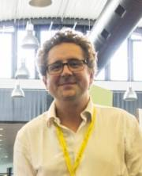

# MIAI Hubot Chair
## Human-Centered Programming by Demonstration for Collaborative Industrial Robotics

The HUBOT Chair is an innovative and interdisciplinary research project funded under the MIAI Cluster IA until **June 2030**. It aims to bridge fundamental AI research and industrial application by shifting how collaborative robots are programmed in the era of Industry 4.0.

---

## Chair Leadership & Contacts

  

    <h3>Damien Pellier — Chair Holder</h3>
    <ul>
      <li><strong>Position:</strong> Professor of Computer Science, Université Grenoble Alpes</li>
      <li><strong>Lab / Team:</strong> LIG (UMR 5217) — Head of Marvin Team</li>
      <li><strong>Office:</strong> Room 365, IMAG Building, Grenoble</li>
      <li><strong>Contact:</strong> +33 4 57 42 15 39 | damien.pellier@imag.fr</li>
    </ul>
  

  

    
  

---

### Flavien Paccot — Co-Chair
* **Position:** Permanent Faculty, Université Clermont Auvergne
* **Lab / Team:** Institut Pascal (UMR 6602 - UCA/CNRS) — CaVITI Team
* **Affiliations:** Clermont Auvergne INP / CHU Clermont-Ferrand
* **Location:** Institut Pascal, Clermont-Ferrand
* **Contact:** +33 4 73 17 71 85 | flavien.paccot@uca.fr

## 🧠 Project Overview & Objectives

In the context of Industry 4.0, reprogramming industrial robots remains a costly and complex task requiring expert intervention. Rigid, traditional programming approaches lack the agility needed for modern manufacturing environments characterized by high product variability.

The **HUBOT Chair** proposes an innovative framework based on **Programming by Demonstration (PbD)**, enabling non-expert operators to teach collaborative robots through intuitive kinesthetic, haptic, or visual interactions.

### Key Research Pillars:
- **Neuro-Symbolic Learning:** Designing advanced learning algorithms capable of extracting and generalizing trajectories from a limited number of human demonstrations.
- **Semantic Task Models:** Incorporating models that capture high-level task intentions, formal logic, and constraints (PDDL/HTN).
- **Co-Manipulation Models:** Developing a novel co-manipulation framework that facilitates natural human-robot collaboration without requiring users to adapt to the robot.
- **Cognitive Ergonomics & Health:** Investigating **acceptability, transparency, and comprehension** factors, leveraging medical and clinical insights for human operator well-being in industrial tasks.

The ultimate goal of the HUBOT Chair is to produce a **human-centered, semantically aware robotic demonstrator**, marking a significant step toward intelligent, adaptive, and trustworthy robotics for the factories of the future.

---

## 🤝 Partners & Academic Network

The HUBOT Chair thrives on a strong ecosystem combining cutting-edge academic labs, medical institutions, and major industrial leaders:

* **Academic & Institutional Partners:**
  * [LIG - Laboratoire d'Informatique de Grenoble](http://www.liglab.fr/) (Marvin Team, Université Grenoble Alpes)
  * [Institut Pascal](http://www.institutpascal.uca.fr/) (CaVITI Team, UMR 6602 - UCA/CNRS)
* **Industrial Leaders:**
  * Stäubli
  * Kassow Robots

---

## 📬 Join the Project / Contact

We are actively looking for talent, collaboration, and industrial use cases. If you are interested in joining the HUBOT project or have any inquiries regarding our automated planning and robotics framework, please feel free to reach out to either co-runner.
